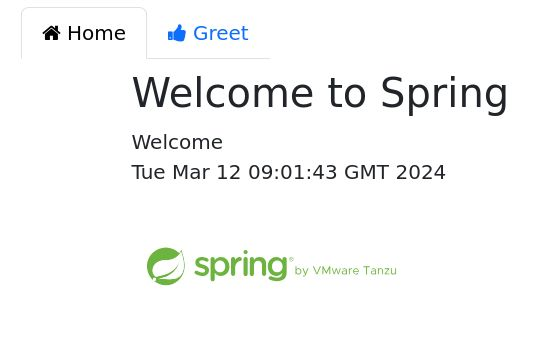
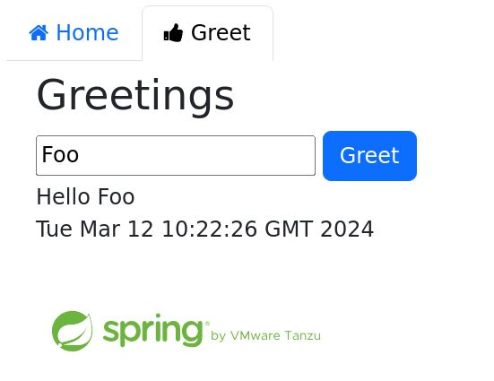
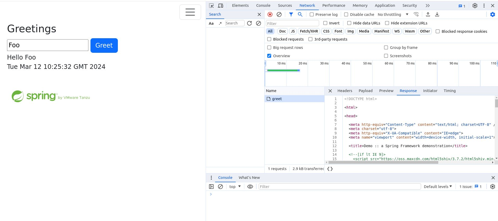
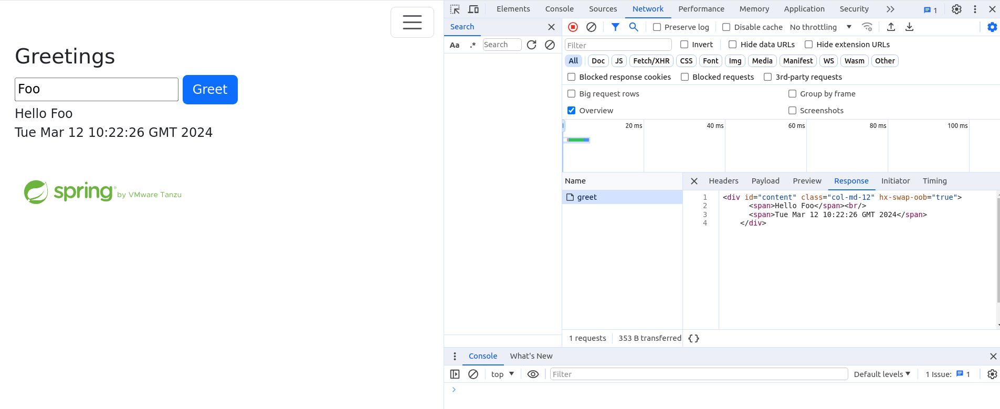

# Hypermedia and Browser Enhancement

Front end development these days is dominated by large JavaScript client side frameworks. There are plenty of good reasons for that, but it can be very inefficient for many use cases, and the framework engineering has become extremely complex. In this article, I want to explore a different approach, one that is more efficient and more flexible, built from smaller building blocks, and well-suited to server side application frameworks like Spring (or similar tools in a range of server side languages). The idea is to embrace the concept of hypermedia, imagine how a next-generation browser would make use of that, and use a small amount of JavaScript to enhance today's browser to that level. Modern browsers ignore custom elements and attributes in HTML, but they allow the author of that content to use JavaScript to define the behaviour for them. There are a few libraries already available that can help with this, and we will be looking at [HTMX](https://htmx.org/), [Unpoly](https://unpoly.com) and [Hotwired Turbo](https://turbo.hotwired.dev). We will also look at how to use these libraries with [Spring Boot](https://spring.io/projects/spring-boot), and how to use them with a traditional server side framework like [Thymeleaf](https://www.thymeleaf.org/).

You can find the source code in GitHub ([dsyer/webmvc-thymeleaf](https://github.com/dsyer/webmvc-thymeleaf)). The "main" branch is the starting point, and there are branches for each of the libraries we will be exploring.

## The Starting Point

As a starting point we are going to use a simple, but not trivial Spring Boot application using thymeleaf. It was created initially for performance testing of Thymeleaf and Spring Webmvc, so we wanted to have some "real" application features but there is no need for a database or any further dependencies. There are 2 tabs, one static (see `SampleController`):

```java
@GetMapping(path = "/")
String user(Map<String, Object> model) {
	model.put("message", "Welcome");
	model.put("time", new Date());
	return "index";
}
```



and one with a form that the user can submit to create a greeting:

```java
@PostMapping(path = "/greet")
String name(Map<String, Object> model, @RequestParam String name) {
	greet(model);
	model.put("greeting", "Hello " + name);
	model.put("name", name);
	return "greet";
}
```



Both tabs are rendered as separate pages on the server, but they use a shared `layout.html` template to display the header and footer. There is a `messages.properties` file with some internationalizable content, although only the default English version is included so far.

The only JavaScript and CSS in the application is in the `layout.html` template, and it is used to toggle the tab header on narrow screens. It is a simple example of progressive enhancement, and it is a good starting point for our exploration of hypermedia and browser enhancement.

To run the app in an IDE use the `main()` method in `WebmvcApplicationTests`, or on the command line use `./mvnw spring-boot:test-run`.

## HTMX

We can start by adding HTMX to the application. HTMX is a small JavaScript library that allows you to use custom attributes in HTML to define the behaviour of the elements in the page. It is a bit like a modern version of the `onclick` attribute, but it is more powerful and more flexible. It is also more efficient, because it uses the browser's built-in HTTP stack to make requests, and it can use the browser's built-in caching and history management. It is a good fit for server side frameworks like Spring Boot, because it allows you to use the server to generate the content and the behaviour of the page, and it allows you to use the browser's built-in features to manage the navigation and the history.

The simplest way to do that would be to grab it from a CDN and add it to the `layout.html` template:

```html
<script src='https://unpkg.com/htmx.org/dist/htmx.min.js'></script>
```

Instead of this, in the "htmx" branch of the sample code we used a [Webjar](https://webjars.org) to load the library into the classpath, so that would work as well. Spring can do some extra stuff to help the browser cache the library, and it can also help with version management.

### Form Processing

One feature we can easily add is to use HTMX to submit the form without a full page reload. We can do that by adding a `hx-post` attribute to the form element:

```html
<form th:action="@{/greet}" method="post" hx-post="/greet">
	<input type="text" name="name" th:value="${name}"/>
	<button type="submit" class="btn btn-primary">Greet</button>
</form>
```

This will cause HTMX to intercept the submit action on the form and send the data to the server using an AJAX request. The server will process the request and return the result, and HTMX will replace the content of the form with the result.

That isn't what we want in this case because the form controls some content in a different (sibling) element on the page. We fix that by adding an `hx-target` attribute to the form element:

```html
<form th:action="@{/greet}" th:hx-post="@{/greet}" method="post" hx-target="#content">
```

where the "content" element has been identified by ID. Turning to that element, we need the ID and also an `hx-swap-oob` attribute to tell HTMX that incoming content should replace the existing content ("out of band" from the original submit action):

```html
<div id="content" class="col-md-12" hx-swap-oob="true">
	<span th:text="${greeting}">Hello, World</span><br/>
	<span th:text="${time}">21:00</span>
</div>
```

With these two small changes in the `greet.html` template, we have a form that submits to the server and updates the page without a full page reload. If you submit the form now, and look at the network activity in the browser developer tools, you will see that the server is re-rendering the whole page, but HTMX is extracting the "content" element and switching its content for us. The images and other static content are not reloaded, and the browser's history is updated to reflect the new state of the page.



You may also notice that HTMX is adding a `hx-request` header to the request to the server. This is a feature of HTMX that allows you to match requests in the server side code, and we will use that next.

### Using a Fragment Template

The server is still rendering the whole page for the form submission, but we can make it more efficient by using a fragment template. We can do that by adding a `th:fragment` attribute to the `greet.html` template:

```html
<div id="content" th:fragment="content" class="col-md-12" hx-swap-oob="true">
	<span th:text="${greeting}">Hello, World</span><br/>
	<span th:text="${time}">21:00</span>
</div>
```

and then we can use that fragment in a new mapping method in the `SampleController` which only triggers when the request comes from HTMX (by matching the `hx-request` header):

```java
@PostMapping(path = "/greet", headers = "hx-request=true")
String nameHtmx(Map<String, Object> model, @RequestParam String name) {
	greet(model);
	return "greet :: content";
}
```

(The "::" syntax is a Thymeleaf feature that allows you to render a fragment of a template. This one says, find the "greet" template and look for a fragment called "content".)

If you submit the form now, and look at the network activity in the browser developer tools, you will see that the server is only returning the fragment of the page that is needed to update the content.



### Lazy Loading

Another common use case is to load content from the server when the page first loads, and maybe even to tailor it to the user's preferences. We can do that with HTMX by adding a `hx-get` attribute to the element that we want to trigger the request. We can experiment with the logo in the `layout.html` template. Instead of statically including the image:

```html
<div class="row">
	<div class="col-12">
	
	</div>
</div>
```

we can use a placeholder:

```html
<div class="row">
	<div class="col-12">
	<span class="fa fa-spin fa-spinner" style="width:200px; text-align:center;">
	</div>
</div>
```

and then get HTMX to load it dynamically:

```html
<div class="row">
	<div class="col-12" hx-get="/logo" hx-trigger="load">
	<span class="fa fa-spin fa-spinner" style="width:200px; text-align:center;">
	</div>
</div>
```

Note the addition of `hx-get` and `hx-trigger`. The `hx-trigger` attribute tells HTMX to trigger the request when the page loads. The default is to trigger on click.

The `hx-get` attribute tells HTMX to make a GET request to the server to get the content for the element. So we need a new mapping in `SampleController`:

```java
@GetMapping(path = "/logo")
String logo() {
	return "layout :: logo";
}
```

which is just rendering the fragment of the `layout.html` template that contains the image. The `layout.html` template has to be modified to include the `th:fragment` attribute:

```html
<div class="row" th:remove="all">
	<div class="col-12" th:fragment="logo">
	
	</div>
</div>
```

Note that we have to `th:remove` the fragment from the template, because the placeholder is going to replace it on the initial render. If you run the app now, you will see that the spinner is replaced by the image when the page loads. This will be visible in the network activity in the browser developer tools.

### Spring Boot HTMX

HTMX has more features that we don't have space to look at in detail here. It is worth mentioning that there is a Java library that can help with those features and it also has some Thymeleaf utilities: [Spring Boot HTMX](https://github.com/wimdeblauwe/htmx-spring-boot) by [Wim Deblauwe](https://github.com/wimdeblauwe), available as a dependency in Maven Central. It can do the `hx-request` header matching with a custom annotation, and it can also help with other features of HTMX.

## Other Libraries

There are other libraries that have similar goals to HTMX, but they have a different focus and a different set of features. We will look at two of them. With both it is very easy to get to the same point that we did with HTMX, but they also have some more complex features that we will leave you to explore on your own.

### Unpoly

The CDN link for Unpoly is:

```html
<script src='https://unpkg.com/unpoly/unpoly.min.js'></script>
```

and the "unpoly" branch in the sample code uses Webjars, as before. The basic (whole page rendering) form submission example looks like this:

```html
<div class="col-md-12">
	<form th:action="@{/greet}" method="post" up-target="#content">
	<input type="text" name="name" th:value="${name}"/>
	<button type="submit" class="btn btn-primary">Greet</button>
	</form>
</div>
<div id="content" class="col-md-12">
	<span th:text="${greeting}">Hello, World</span><br/>
	<span th:text="${time}">21:00</span>
</div>
```

so `hx-target` becomes `up-target` and the rest of the HTMX decorations are just the default in Unpoly.

To convert to a fragment template, we would need to follow the pattern from HTMX: add a `th:fragment` and a controller method that matches a unique header from Unpoly, e.g. `X-Up-Context`.

### Hotwired Turbo

The CDN link for Hotwired Turbo is:

```html
<script src='https://unpkg.com/@hotwired/turbo/dist/turbo.es2017-umd.js'></script>
```

and the "turbo" branch in the sample code uses Webjars, as before. The basic form submission example looks like this:

```html
<turbo-frame id="content">
	<div class="col-md-12">
	<form th:action="@{/greet}" method="post">
		<input type="text" name="name" th:value="${name}" />
		<button type="submit" class="btn btn-primary">Greet</button>
	</form>
	</div>
	<div class="col-md-12">
		<span th:text="${greeting}">Hello, World</span><br />
		<span th:text="${time}">21:00</span>
	</div>
</turbo-frame>
```

Instead of custom attributes identifying the form processing interaction, Turbo uses a custom element (`turbo-frame`) to identify the content that is going to be replaced. The rest of the form is unchanged.

To convert to a fragment template, we would need to add a `th:fragment` declaration to the `<turbo-frame>` and a controller method that matches a unique header from Turbo, e.g. `Turbo-Frame`.

## Conclusion

HTMX is very focused on simple hypermedia enhancements and, while it has evolved to include some extra features (mostly as plugins), it stays true to its original vision of simulating a next-generation browser and keeping the feature set as narrow as possible. It also has a very entertaining social media presence, if you like that sort of thing. The other two libraries are more ambitious and cover a lot more ground, but they share enough with HTMX that the examples we have looked at here are very similar. Any server side framework that can generate HTML can be used with these libraries, and they can be used to enhance the browser experience without the need for a large JavaScript framework. They are also a good fit for server side frameworks like Spring Boot, because they allow you to use the server to generate the content and the behaviour of the page. The templates are best rendered on the server with an engine that knows about fragments, so Thymeleaf was working fine, but there are other choices. There's also nothing stopping you from using HTMX (and friends) with a full JavaScript framework, and if you like it you can start to slowly replace framework components with hypermedia interactions.
